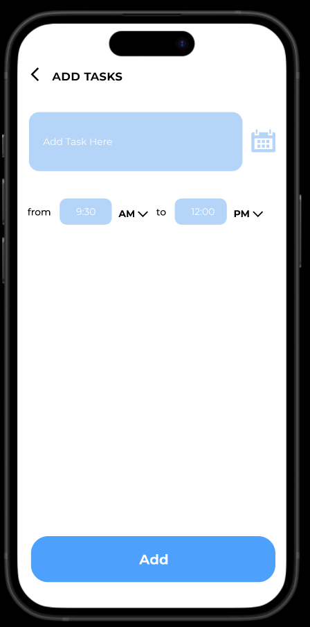

# Project Todo App

## Description

Project Todo App is a simple and intuitive application designed to help users manage their tasks efficiently. Built using Flutter, this app provides a seamless user experience with a clean and modern interface. Users can add, edit, delete, and mark tasks as complete, ensuring they stay organized and productive.

## Features

- Add new tasks
- Edit existing tasks
- Delete tasks
- Mark tasks as complete
- User-friendly interface
- Cross-platform compatibility (iOS and Android)

## Screenshots

### Home Screen


### Add Task Screen


### Task List


## Installation

1. Clone the repository:
   ```sh
   git clone https://github.com/mohammed-alshabibi/project-todoapp-flutter.git
